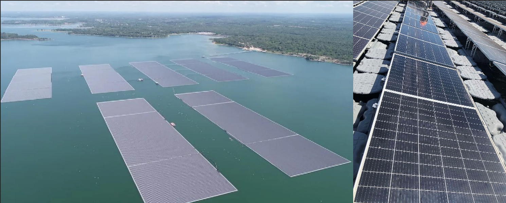
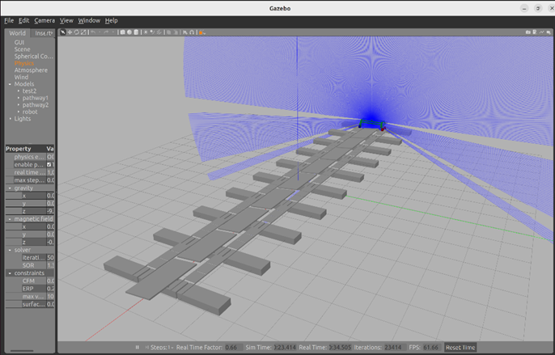
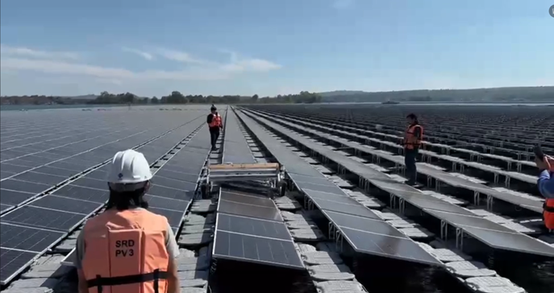
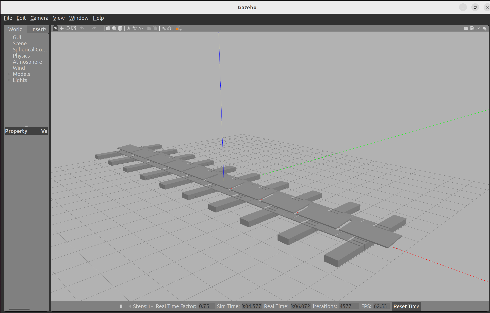
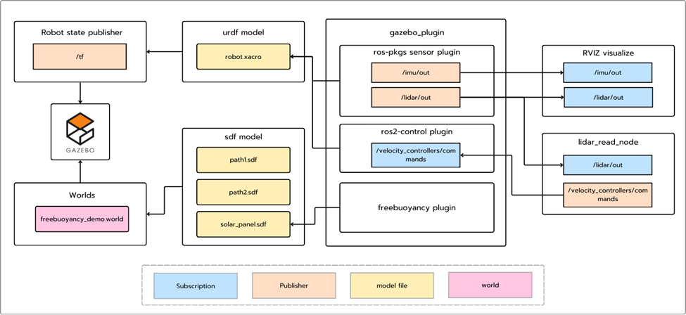

# **Introduction**
This project is inspired by an ongoing real-world research initiative involving autonomous robots designed to navigate solar floating platforms installed on buoyant structures in the middle of Sirindhorn Dam. The integration of autonomous robotic systems aims to enhance their maintenance, monitoring, and operational efficiency



In this project, we recreate this scenario in a simulated environment using ROS2 and Gazebo. The simulation is designed to replicate real-world dynamics as accurately as possible, incorporating realistic physics, including the buoyancy effects of the floating buoys. The robot is equipped with virtual sensors such as a 2D LiDAR and an IMU. These sensors provide feedback on the robot's movement and enable precise control for navigation and compensation of the robot movement within the floating solar platform environment
 


The objective of this simulation is to create a virtual testing ground for developing and refining algorithms for autonomous navigation, path planning, and environmental interaction. By closely mirroring the conditions of the Sirindhorn Dam, this project provides a valuable platform for testing and improving the performance of the robotic system before real-world deployment.

 

# **Set up and installation**
Before starting, ensure you have the following installed: <br>
    •	Operating System: Ubuntu 22.04 (recommended)<br>
    •	ROS 2: Humble or compatible version<br>
    •	Gazebo: Fortress or compatible version<br>
    •	Python: 3.10+<br>
    •	colcon: For building the ROS 2 workspace<br><br>
Install ROS 2 and Gazebo by following their official installation guides:<br>
    •	[ROS 2 Installation Guide](https://docs.ros.org/en/humble/Installation.html)<br>
    •	[Gazebo Installation Guide](https://classic.gazebosim.org/tutorials?tut=install_ubuntu)<br>
<br>

Then installed all the dependency of this project by this command 

```
sudo apt install ros-humble-gazebo-ros-pkgs
```
```
sudo apt install ros-humble-robot-state-publisher
```
```
sudo apt install ros-humble-controller-manager
```
```
sudo apt install ros-humble-gazebo-ros2-control
```
```
sudo apt-get install ros-humble-imu-tools
```

Then clone the library repository that we going to use in the desire directory

```
cd ~ | git clone https://github.com/Ling-ling00/Solar-Floating-cleaning-robot-simulation.git -b floating Lib_Solar-Floating-cleaning-robot-simulation
```
then build the workspace with this command  
```
cd Lib_Solar-Floating-cleaning-robot-simulation 
mkdir build
cd build
cmake ..
make
sudo make install
```
Then installed project using this command 
```
cd ~ | git clone https://github.com/Ling-ling00/Solar-Floating-cleaning-robot-simulation.git
```
then build the workspace with this command  
```
cd Solar-Floating-cleaning-robot-simulation
colcon build
```
Then source the installation with this command 
```
source install/setup.bash
cd src/lidar_gazebo
source gazebo.sh
```
Then test the installation with this command 
```
gazebo worlds/freebuoyancy_demo.world -u
```
If the installation successful, The world that replicate the Solar-floating will appear with realistic buoyancy in each floating buoy


 
# **System architect**



## **Robot State Publisher**
-	Publishes the /tf topic by taking the robot.xacro URDF model and computing the transforms between the robot’s links.
## **World**
-	Simulates a floating solar cell panel in Gazebo by combining SDF models with the FreeBuoyancy plugin.
## **Gazebo Simulation**
-	Uses Gazebo as the physics engine to visualize and simulate buoyancy effects and the robot’s movements within the world.
## **Gazebo Plugins**
-	**Sensor Plugins**
    -	Publish data from simulated IMU and LiDAR sensors via the topic imu/out and lidar/out.
-	**ROS 2 Control Plugin**
    -	Apply control of robot wheels’ velocity via /velocity_controllers/commands topic using ROS 2 controllers.
-	**Freebuoyancy Plugin**
    -	Simulates buoyancy effects in underwater or floating scenarios.
## **Lidar_read_node**
-	Subscribes to the /lidar/out topic and calculates the error in rotation and position offset. And uses a P-controller to correct the robot’s position and rotation accordingly by publish /velocity_controllers/commands topic.
## **RVIZ**
-	Visualizes the robot’s movement, the IMU data in the robot’s base frame, and the LiDAR data in real-time.

# **Technical detail**
-	ใส่  part detail ที่ได้จาก solid work มาใส่กับหุ่น
-	รายละเอียด sensor 2 อัน
-	รายละเอียด world 
# **Demo & How to use** 
-	วิธี run world เปล่า เล่น buoyancy 
-	Run เต็ม
# **Validation**
-	Video + 3d graph เทียบารเคลื่อนที่ 
# **Future plan**


# **Contributor**


