# **Introduction**
This project is inspired by an ongoing real-world research initiative involving autonomous robots designed to navigate solar floating platforms installed on buoyant structures in the middle of Sirindhorn Dam. The integration of autonomous robotic systems aims to enhance their maintenance, monitoring, and operational efficiency

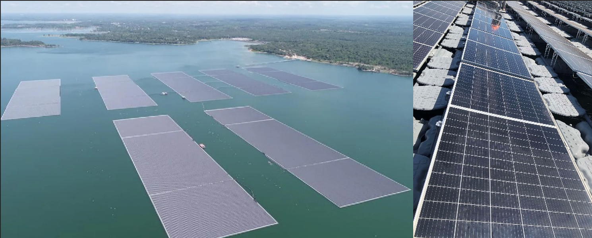

In this project, we recreate this scenario in a simulated environment using ROS2 and Gazebo. The simulation is designed to replicate real-world dynamics as accurately as possible, incorporating realistic physics, including the buoyancy effects of the floating buoys. The robot is equipped with virtual sensors such as a 2D LiDAR and an IMU. These sensors provide feedback on the robot's movement and enable precise control for navigation and compensation of the robot movement within the floating solar platform environment
 
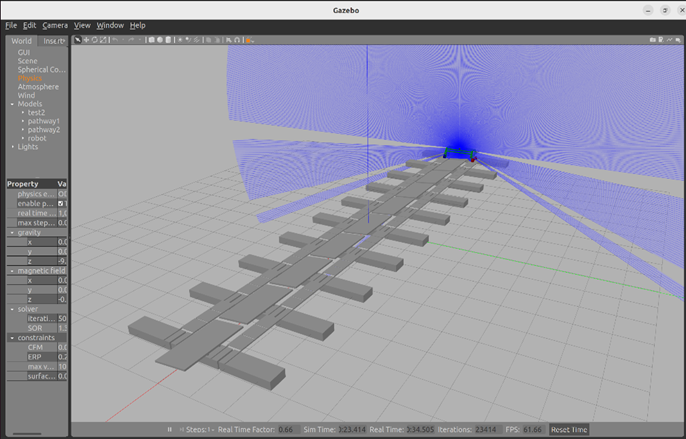

The objective of this simulation is to create a virtual testing ground for developing and refining algorithms for autonomous navigation, path planning, and environmental interaction. By closely mirroring the conditions of the Sirindhorn Dam, this project provides a valuable platform for testing and improving the performance of the robotic system before real-world deployment.

 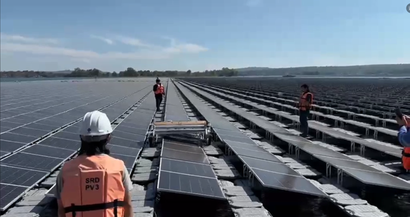

# **Set up and installation**
Before starting, ensure you have the following installed: <br>
    •	Operating System: Ubuntu 22.04 (recommended)<br>
    •	ROS 2: Humble or compatible version<br>
    •	Gazebo: Fortress or compatible version<br>
    •	Python: 3.10+<br>
    •	colcon: For building the ROS 2 workspace<br><br>
Install ROS 2 and Gazebo by following their official installation guides:<br>
    •	[ROS 2 Installation Guide](https://docs.ros.org/en/humble/Installation.html)<br>
    •	[Gazebo Installation Guide](https://classic.gazebosim.org/tutorials?tut=install_ubuntu)<br>
<br>

Then installed all the dependency of this project by this command 

```
sudo apt install ros-humble-gazebo-ros-pkgs
```
```
sudo apt install ros-humble-robot-state-publisher
```
```
sudo apt install ros-humble-controller-manager
```
```
sudo apt install ros-humble-gazebo-ros2-control
```
```
sudo apt-get install ros-humble-imu-tools
```

Then clone the library repository that we going to use in the desire directory

```
cd ~ | git clone https://github.com/Ling-ling00/Solar-Floating-cleaning-robot-simulation.git -b floating Lib_Solar-Floating-cleaning-robot-simulation
```
then build the workspace with this command  
```
cd Lib_Solar-Floating-cleaning-robot-simulation 
mkdir build
cd build
cmake ..
make
sudo make install
```
Then installed project using this command 
```
cd ~ | git clone https://github.com/Ling-ling00/Solar-Floating-cleaning-robot-simulation.git
```
then build the workspace with this command  
```
cd Solar-Floating-cleaning-robot-simulation
colcon build
```
Then source the installation with this command 
```
source install/setup.bash
cd src/lidar_gazebo
source gazebo.sh
```
Then test the installation with this command 
```
gazebo worlds/freebuoyancy_demo.world -u
```
If the installation successful, The world that replicate the Solar-floating will appear with realistic buoyancy in each floating buoy


https://github.com/user-attachments/assets/1365718d-9e7d-4cc0-9009-030b1e0e45ab


# **System architect**

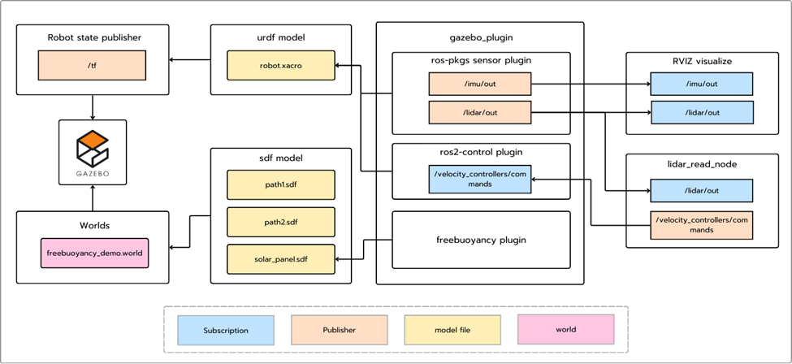

## **Robot State Publisher**
-	Publishes the /tf topic by taking the robot.xacro URDF model and computing the transforms between the robot’s links.
## **World**
-	Simulates a floating solar cell panel in Gazebo by combining SDF models with the FreeBuoyancy plugin.
## **Gazebo Simulation**
-	Uses Gazebo as the physics engine to visualize and simulate buoyancy effects and the robot’s movements within the world.
## **Gazebo Plugins**
-	**Sensor Plugins**
    -	Publish data from simulated IMU and LiDAR sensors via the topic imu/out and lidar/out.
-	**ROS 2 Control Plugin**
    -	Apply control of robot wheels’ velocity via /velocity_controllers/commands topic using ROS 2 controllers.
-	**Freebuoyancy Plugin**
    -	Simulates buoyancy effects in underwater or floating scenarios.
## **Lidar_read_node**
-	Subscribes to the /lidar/out topic and calculates the error in rotation and position offset. And uses a P-controller to correct the robot’s position and rotation accordingly by publish /velocity_controllers/commands topic.
## **RVIZ**
-	Visualizes the robot’s movement, the IMU data in the robot’s base frame, and the LiDAR data in real-time.

# **Technical detail**
## **Robot**
-	In this project we simulate robot mass and inertia approximately to real robot by follow the properties in CAD

Robot body mass and inertia
- from Solidworks
  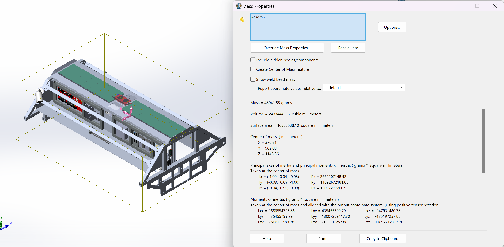

- from URDF
<br>

  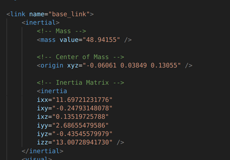

  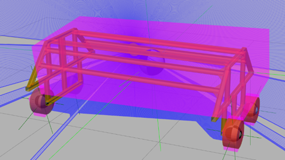

Robot wheel mass

- from Solidworks
  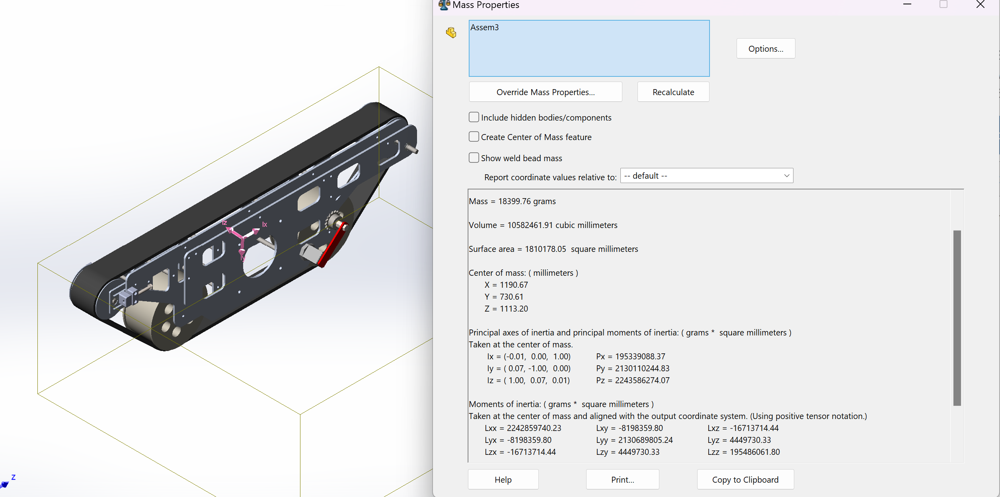

- from URDF

  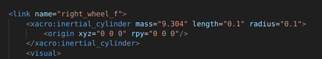

## **Sensor**
-	To visualize the position and rotation of robot we visualize 2 sesors
-	**LiDAR** position of LiDAR is at the top of robot and look down to detect the edge of solar cell panel.

Data that LiDAR can read visualize in RVIZ

 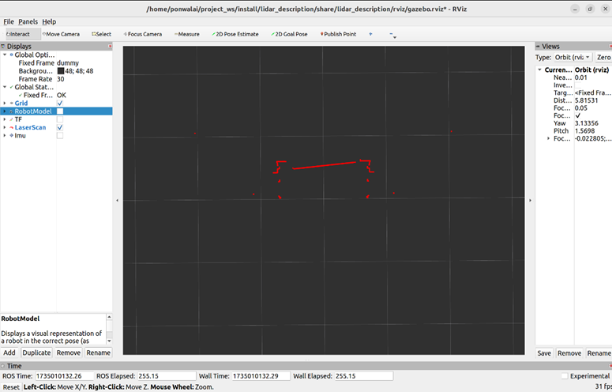

Position of robot in simulation 

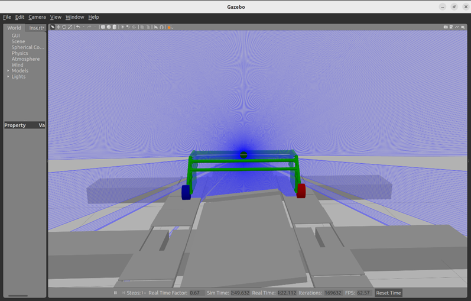

-	**IMU** position of imu is at the base of robot to calculate rotation around Y-axis for report that is robot in the hole between floating.

Data that IMU can read visualize in RVIZ

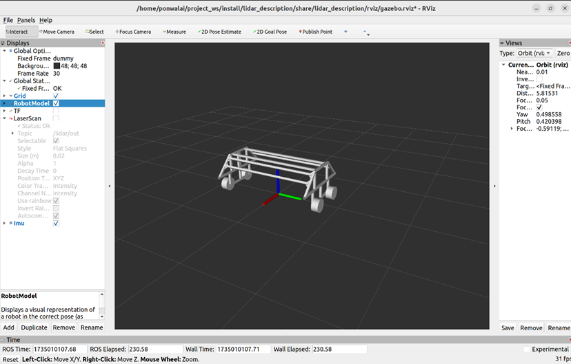
  
Position of robot in simulation

 

- **Sensor in RVIZ when robot move**


https://github.com/user-attachments/assets/03a8ee77-5b48-41c8-a204-88570e8a8162


## **World**
-	In the world file will be include 3 SDF file 
 
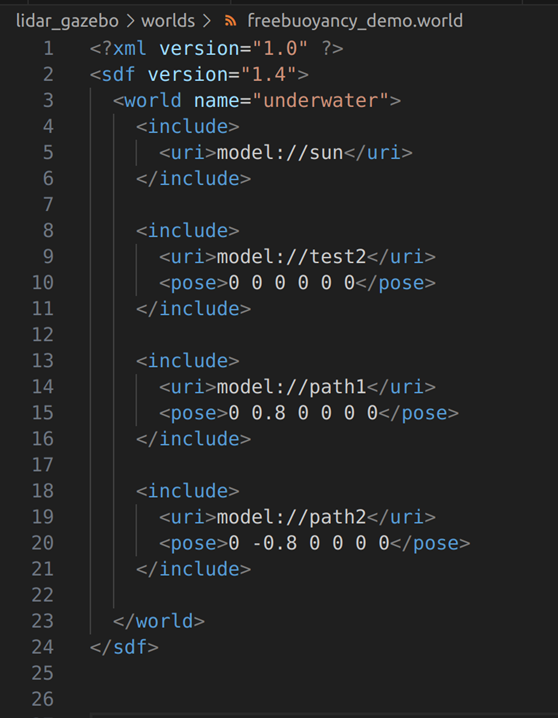

## test2 or floating buoy and Solar panel 

This file will consist of floating buoy and Solar panel in sdf form 

 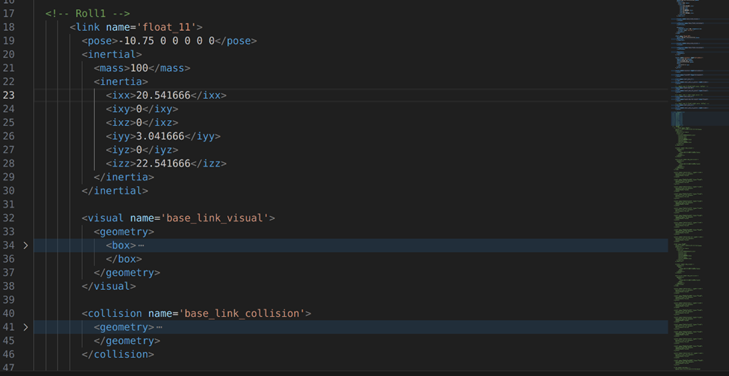
 
 with the plugin freebuoyancy_gazebo from libraly libfreebuoyancy_gazebo 
 
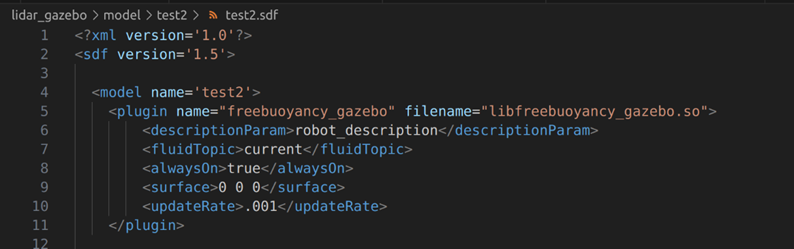

Visualize of test2.sdf 

 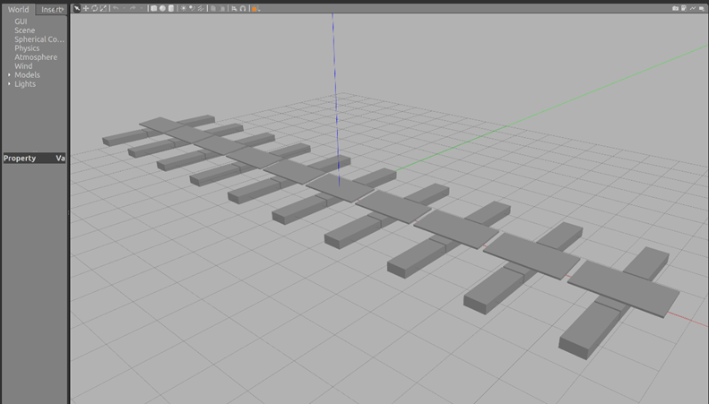

## Path1 and path2 
Is the path ways for the robot movement that will be place above the floating buoy.In this sdf file will not include the buoyancy plugin 

 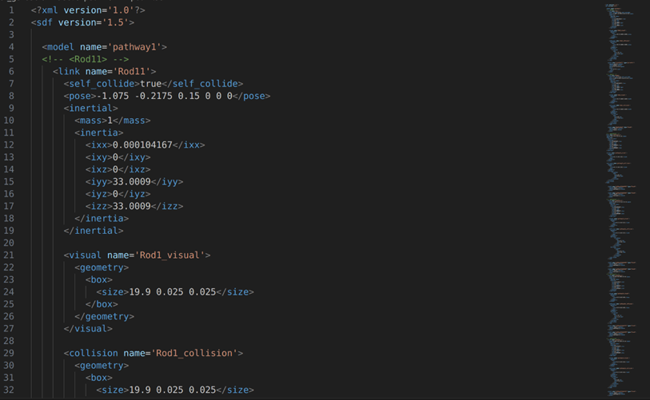


Visualize of path1 and path2 that are on top of the  test2.sdf 

 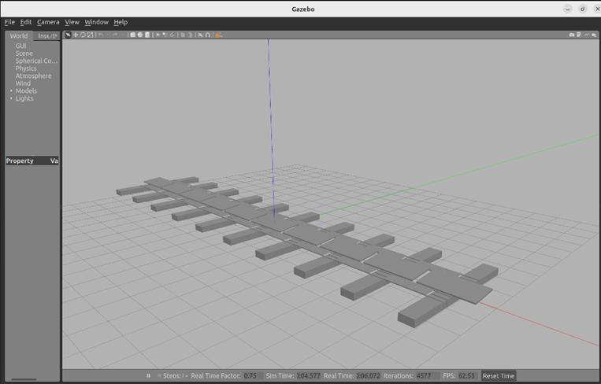

# **Demo & How to use** 
## **World launch**
To launch the empty world use this command 
```
ros2 launch lidar_gazebo test_world.launch.py
```
The result of the command will open the gazebo world with only the solar panel and floating buoy 

 
 

https://github.com/user-attachments/assets/1561b423-06fe-4b72-acf7-d6714c68a1a9


## **World with robot launch**
To launch solar panel and floating buoy with robot run this command
```
ros2 launch lidar_gazebo gazebo.launch.py
```

 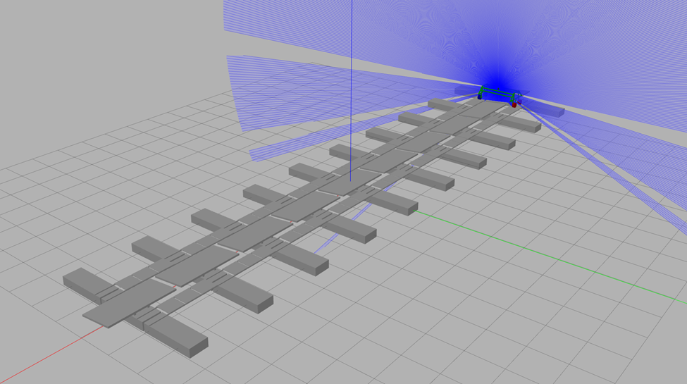

## **Controller**
To control robot with controller
```
ros2 run solar lidar_read_sim.py
```
The result of the command will control the robot to middle of solar cell panel.

To control robot with fixed speed (v(l) is left front and back wheel speed in forward direction and v(r) is right front and back wheel speed in forward direction)
```
ros2 topic pub /velocity_controllers/commands std_msgs/msg/Float64MultiArray "layout:
  dim: []
  data_offset: 0
data: [-v(l), -v(l), v(r), v(r)]"
``` 
The result of the command will control the robot with fixed velocity (run with out controller).

https://github.com/user-attachments/assets/7f2d34ed-a98f-44a5-b9d9-cc468a4d6c4c


# **Validation**

## with controller vs with out controller

### with controller 

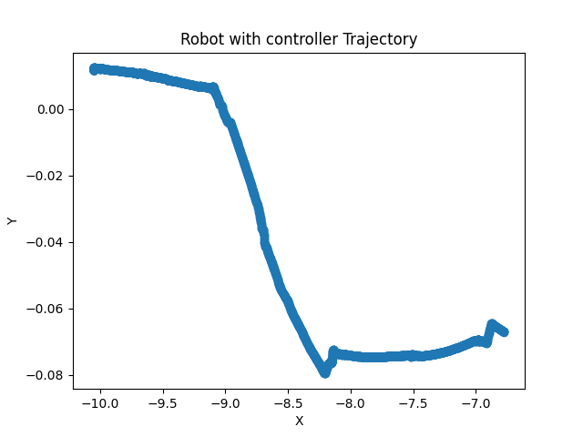

With the feedback that is read from the sensor (lidar and IMU) and feed that input to the controller. We plot the movement of the robot to the graph. from the graph XY axis we will see that the robot trajectory will tend to converge by compensate each side of the wheel velocity to steady point that are the middle of the floating buoy 

### without controller

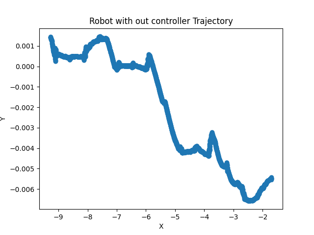

From the graph XY axis we will see that the robot trajectory has a stack error and will converge to left or right side and at some point, if that stack error is high enough the robot will fall of the buoy

## World with buoyancy and with out buoyancy 

### with buoyancy 

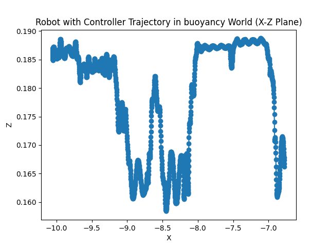

with the buoyancy ,the robot movement in XZ axis when move along the floating bouy will not be that pattern and when the robot move and fall on the floating bouy the grpah will show the movement that act like the water wave like in the X axis value -8.0 till -9.0 that wave is the sign that indicate the wave that similar to water wave 

### with out buoyancy

world with plane 

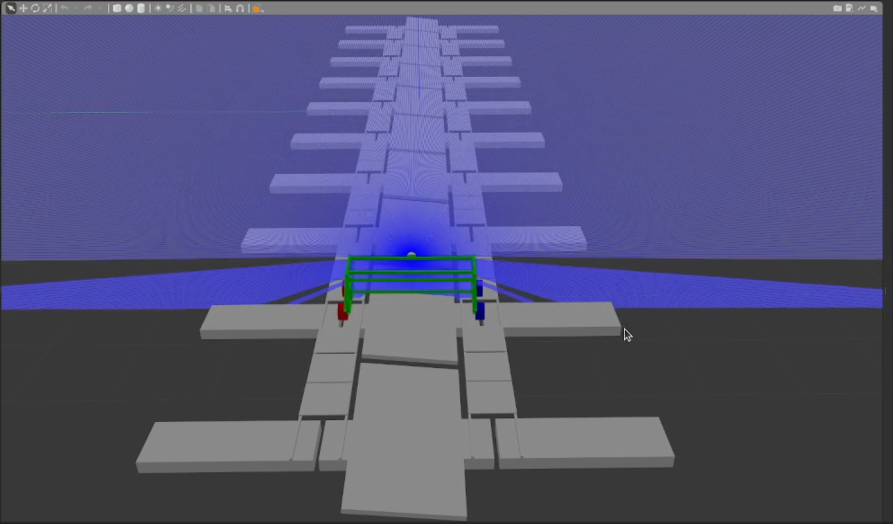

movement graph

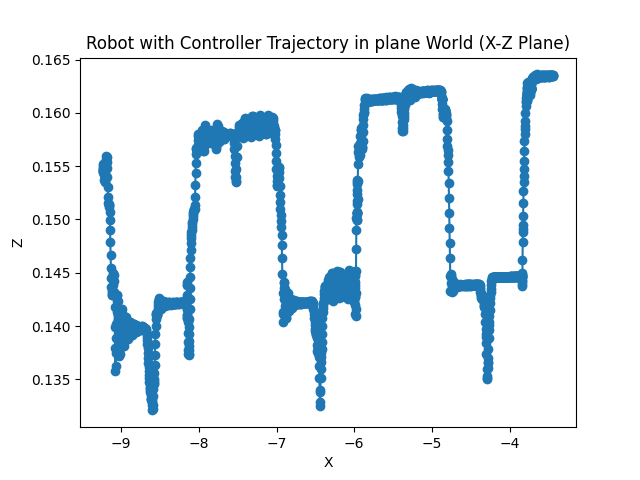


with out the buoyancy ,the robot movement in XZ axis when move along the floating bouy will be that pattern with every step of the floating bouy is similar to each other


# **Future plan**


